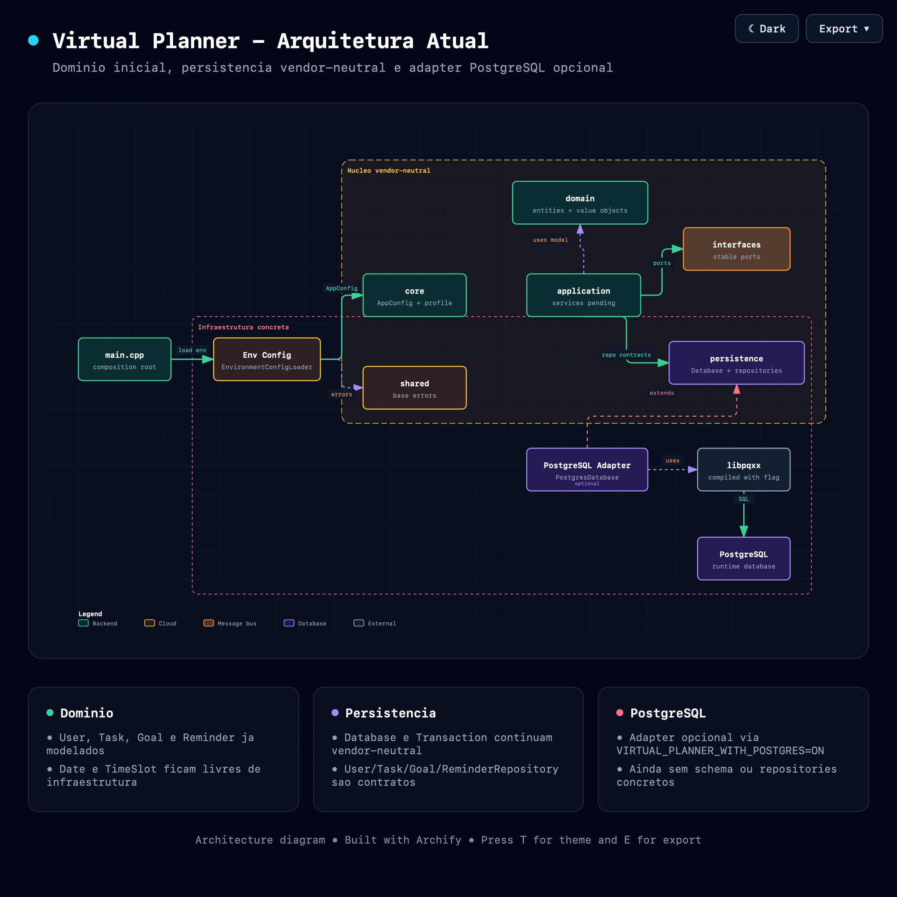

# Virtual Planner

Virtual Planner é um projeto acadêmico desenvolvido em C++20 para ajudar no planejamento pessoal.

O projeto possui uma estrutura inicial para usuários, tarefas, metas e lembretes. Também oferece suporte opcional ao PostgreSQL.

## Objetivos

- Manter o código simples e organizado.
- Separar as principais partes do sistema.
- Compilar o projeto com CMake e C++20.
- Permitir o uso opcional do PostgreSQL.
- Criar uma base para tarefas, metas e lembretes.
- Manter testes que não dependam de um banco real.

## Requisitos

- Compilador com suporte a C++20.
- CMake 3.20 ou superior.
- `libpqxx` apenas para usar PostgreSQL.
- Docker opcional.

## Compilação

### Sem PostgreSQL

Esta é a opção padrão:

```bash
cmake -S . -B build
cmake --build build
```

### Com PostgreSQL

É necessário instalar o `libpqxx` antes de compilar:

```bash
cmake -S . -B build-postgres -DVIRTUAL_PLANNER_WITH_POSTGRES=ON
cmake --build build-postgres
```

## Execução

Sem PostgreSQL:

```bash
./build/virtual_planner
```

Com PostgreSQL:

```bash
VP_USE_POSTGRES=true ./build-postgres/virtual_planner
```

## Configuração do PostgreSQL

As configurações são feitas por variáveis de ambiente:

- `POSTGRES_HOST`: padrão `localhost`.
- `POSTGRES_PORT`: padrão `5432`.
- `POSTGRES_DB`: nome do banco.
- `POSTGRES_USER`: usuário.
- `POSTGRES_PASSWORD`: senha.
- `POSTGRES_SSLMODE`: padrão `disable`.

Use o arquivo `.env.example` como referência. Não envie o arquivo `.env` para o Git.

## Docker

Para iniciar o PostgreSQL localmente:

```bash
docker compose up -d postgres
```

Comandos úteis:

```bash
docker compose ps
docker compose logs -f postgres
docker compose stop
docker compose down
```

Use `docker compose down -v` somente para apagar também os dados locais.

## Testes

Testes padrão:

```bash
ctest --test-dir build --output-on-failure
```

Teste de integração com PostgreSQL:

```bash
ctest --test-dir build-postgres --output-on-failure -R postgres_integration_test
```

O teste de integração precisa das variáveis `POSTGRES_DB`, `POSTGRES_USER` e `POSTGRES_PASSWORD`.

## Estrutura do Projeto

```text
.
├── include/virtual_planner
│   ├── application
│   ├── core
│   ├── domain
│   │   ├── entities
│   │   ├── enums
│   │   └── value_objects
│   ├── infrastructure
│   │   ├── config
│   │   └── postgres
│   ├── interfaces
│   ├── persistence
│   └── shared
├── src
├── tests
├── docs
├── migrations
├── docker-compose.yml
└── CMakeLists.txt
```

## Arquitetura

O projeto está dividido em camadas:

- `domain`: entidades e regras do sistema.
- `application`: futuros serviços e casos de uso.
- `interfaces`: contratos usados pelas diferentes partes do projeto.
- `persistence`: contratos para banco de dados e repositórios.
- `infrastructure`: implementações externas, como configuração e PostgreSQL.
- `core` e `shared`: configurações, erros e recursos compartilhados.
- `main.cpp`: inicia e configura a aplicação.

O código principal não depende diretamente do PostgreSQL. A implementação do banco fica em `infrastructure/postgres`.



Outros arquivos do diagrama:

- [`docs/diagrams/current-architecture.html`](docs/diagrams/current-architecture.html)
- [`docs/diagrams/current-architecture.architecture.json`](docs/diagrams/current-architecture.architecture.json)

### Contratos De Persistência

- `persistence::Database`: abstração de ciclo de vida de persistência, independente de fornecedor.
- `persistence::Transaction`: contrato mínimo para `commit()` e `rollback()`.
- `persistence::*Repository`: contratos de repositório para as entidades de domínio, ainda sem implementação concreta de banco.
- `infrastructure::postgres::PostgresConfig`: configuração externa da conexão PostgreSQL.
- `infrastructure::postgres::PostgresDatabase`: adapter concreto baseado em `libpqxx`, compilado apenas com `VIRTUAL_PLANNER_WITH_POSTGRES=ON`.
- `infrastructure::postgres::PostgresTransaction`: transação PostgreSQL com rollback automático no destrutor se não houver `commit()`.

## Domínio Inicial

O projeto possui as seguintes entidades:

- `User`
- `Task`
- `Goal`
- `Reminder`

Também possui tipos auxiliares para datas, horários, categorias, prioridades e status:

- Value objects: `Date` e `TimeSlot`.
- Enums: `Category`, `Priority`, `TaskStatus`, `GoalStatus`, `GoalPeriod`, `ReminderType`, `ReminderRecurrence` e `Shift`.

## Documentação

Documentos adicionais estão disponíveis na pasta `docs/`, incluindo guias de arquitetura, convenções, PostgreSQL e primeiros passos.

## Status Atual

- Build sem PostgreSQL funcionando.
- Testes unitários funcionando.
- Suporte opcional ao PostgreSQL implementado.
- Entidades iniciais implementadas, incluindo value objects e enums.
- Contratos de repositórios definidos em `persistence`, ainda sem implementação concreta.
- Serviços, casos de uso e banco de dados completo ainda não implementados.

## Próximos Passos

1. Adicionar serviços e casos de uso.
2. Criar mais testes para as regras do sistema.
3. Implementar os repositórios PostgreSQL.
4. Criar as tabelas e migrações do banco.
